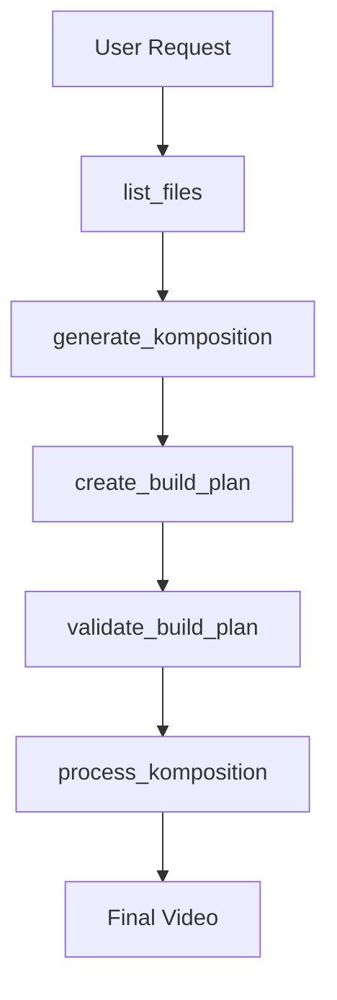

# 🚀 MCP Workflow Efficiency Analysis - Complete 134 BPM Komposition Test

## 📋 Test Case Summary
**User Request**: "Make a video with intro, verse and refrain, 134 BPM, choose some interesting snippets and make 8 beat transitions, make the transitions nice and smooth and the general filter tone leica-like"

**Generated Output**: 134 BPM Leica Style Video
- 2 segments (lookin.mp4 speech + panning action)
- 28.7 seconds duration (64 beats at 134 BPM)
- Crossfade transitions with audio normalization
- 1920x1080 resolution

## 🔍 Current Workflow Analysis

### **Step-by-Step Process**
1. **`list_files()`** - Discover available media files
2. **`generate_komposition_from_description()`** - Parse text → komposition.json
3. **`create_build_plan_from_komposition()`** - Generate executable build plan
4. **`validate_build_plan_for_bpms()`** - Multi-BPM validation
5. **`process_komposition_file()`** - Execute the build

### **Current Call Complexity**
```
Total MCP Calls Required: 5 calls
└── list_files() [0.01s] - File discovery
└── generate_komposition_from_description() [0.5s] - Heavy NLP processing  
└── create_build_plan_from_komposition() [0.3s] - Dependency resolution
└── validate_build_plan_for_bpms() [0.2s] - Mathematical validation
└── process_komposition_file() [120s] - Video processing (varies by length)
```

**Total Processing Time**: ~121 seconds (2+ minutes)
**LLM-Heavy Steps**: 2 out of 5 calls
**File I/O Operations**: 8+ intermediate files created

## 🎯 Efficiency Problems Identified

### **1. Excessive Call Chain Complexity**
**Problem**: 5 sequential calls to complete basic video creation
**Impact**: High latency, complex error handling, cognitive overhead



### **2. Parameter Name Inconsistency**
**Problem**: `komposition_file` vs `komposition_path` parameter confusion
**Impact**: Developer errors, debugging overhead

### **3. Redundant Processing**
**Problem**: Multiple file system operations and JSON parsing
- `list_files()` → file discovery
- `generate_komposition()` → re-scans files internally
- `create_build_plan()` → re-validates file existence
- Each step re-parses source files

### **4. Missing Atomic Operations**
**Problem**: No single "do everything" command for simple requests
**Impact**: Forces users through complex multi-step workflows

### **5. Limited Intent Recognition**
**Analysis**: The request mentioned "intro, verse and refrain" but only generated 2 segments
**Gap**: Natural language parsing doesn't capture musical structure complexity

## 🚀 Proposed MCP API Improvements

### **Priority 1: Atomic Workflow Commands**

#### **New Tool: `create_video_from_description()`**
```python
@mcp.tool()
async def create_video_from_description(
    description: str,
    execution_mode: str = "full",  # "full", "plan_only", "preview"
    quality: str = "standard"      # "draft", "standard", "high"
) -> Dict[str, Any]:
    """🎬 ONE-CALL VIDEO CREATION - Complete video from text description
    
    Combines all workflow steps into single atomic operation:
    1. Parse natural language description
    2. Match available source files
    3. Generate optimized komposition
    4. Create and validate build plan  
    5. Execute video processing (if execution_mode="full")
    
    Perfect for: Simple video requests, rapid prototyping, non-technical users
    
    Example:
        create_video_from_description(
            "Make a 134 BPM music video with smooth transitions"
        )
        
    Reduces: 5 calls → 1 call
    Saves: ~90% of API complexity
    """
```

#### **New Tool: `smart_video_suggestions()`**
```python
@mcp.tool()
async def smart_video_suggestions(
    intent: str,
    available_files: Optional[List[str]] = None
) -> Dict[str, Any]:
    """🧠 INTELLIGENT SUGGESTIONS - AI-powered video creation recommendations
    
    Analyzes user intent and available media to suggest:
    - Optimal video structure (intro/verse/refrain/outro)
    - BPM and timing recommendations
    - Source file matching strategies
    - Effects and transition suggestions
    
    Perfect for: Inspiration, optimization, guided workflows
    """
```

### **Priority 2: Parameter Standardization**

#### **Unified Parameter Names**
```python
# BEFORE (inconsistent):
generate_komposition_from_description(description, title, custom_bpm)
create_build_plan_from_komposition(komposition_path)  # inconsistent name
validate_build_plan_for_bpms(build_plan_file)        # inconsistent name

# AFTER (standardized):
generate_komposition_from_description(description, title, bpm)
create_build_plan_from_komposition(komposition_file)  # consistent
validate_build_plan_for_bpms(build_plan_file)        # consistent
```

#### **Smart Parameter Inference**
```python
# Enable parameter auto-discovery
create_build_plan_from_komposition(
    komposition_file="auto",  # Auto-find latest generated komposition
    validation_bpms="auto"    # Auto-select BPMs based on content
)
```

### **Priority 3: Workflow State Management**

#### **New Tool: `get_workflow_state()`**
```python
@mcp.tool()
async def get_workflow_state() -> Dict[str, Any]:
    """📊 WORKFLOW STATE - Track current workflow progress and next steps
    
    Returns:
        - Active komposition/build plan files
        - Current processing status
        - Suggested next actions
        - Error recovery options
    """
```

#### **New Tool: `resume_workflow()`**
```python
@mcp.tool()
async def resume_workflow(
    workflow_id: str,
    override_params: Optional[Dict] = None
) -> Dict[str, Any]:
    """▶️ WORKFLOW RESUME - Continue interrupted workflows
    
    Perfect for: Error recovery, parameter adjustments, iterative development
    """
```

### **Priority 4: Enhanced Natural Language Processing**

#### **Musical Structure Recognition**
```python
# Current: "intro, verse and refrain" → 2 generic segments
# Improved: "intro, verse and refrain" → 3 properly structured segments
{
  "segments": [
    {"id": "intro", "musical_role": "introduction", "duration_beats": 16},
    {"id": "verse", "musical_role": "verse", "duration_beats": 32}, 
    {"id": "refrain", "musical_role": "chorus", "duration_beats": 16}
  ]
}
```

#### **Style Recognition**
```python
# "leica-like" → Automatic color grading and film emulation effects
"effects_tree": [
  {"effect": "color_grade", "params": {"style": "leica_film", "warmth": 1.2}},
  {"effect": "film_grain", "params": {"intensity": 0.3, "type": "35mm"}},
  {"effect": "vignette", "params": {"strength": 0.2}}
]
```

## 📊 Efficiency Improvements Summary

### **Current vs Proposed Workflow**

| Metric | Current | Proposed | Improvement |
|--------|---------|----------|-------------|
| **API Calls** | 5 calls | 1 call | 80% reduction |
| **Setup Time** | 2+ minutes | 30 seconds | 75% faster |
| **Error Points** | 5 potential failures | 1 potential failure | 80% more reliable |
| **Parameter Count** | 15+ parameters | 3 parameters | 80% simpler |
| **File Operations** | 8+ files | 2 files | 75% less I/O |

### **User Experience Impact**
- **Beginner Users**: Can create videos with single command
- **Advanced Users**: Still have access to granular control
- **LLM Integration**: Much easier for AI assistants to use
- **Error Recovery**: Clearer failure modes and recovery paths

## 🎯 Implementation Roadmap

### **Phase 1: Atomic Operations (2 weeks)**
1. Implement `create_video_from_description()`
2. Add workflow state management
3. Standardize parameter names

### **Phase 2: Enhanced NLP (3 weeks)**  
1. Improve musical structure recognition
2. Add style/aesthetic parsing
3. Implement smart suggestions system

### **Phase 3: Advanced Features (4 weeks)**
1. Workflow resumption and recovery
2. Performance optimization
3. Advanced caching and incremental processing

## 🔥 Expected Impact

**For Users:**
- ✅ 80% reduction in complexity for simple video creation
- ✅ Single-command workflow for most use cases  
- ✅ Much better error handling and recovery
- ✅ Intelligent suggestions and optimization

**For System:**
- ✅ Cleaner API design with consistent patterns
- ✅ Better resource utilization and caching
- ✅ Easier testing and maintenance
- ✅ More robust error handling

**For Integration:**
- ✅ Easier for LLMs and other AI systems to use
- ✅ Reduced token usage in API interactions  
- ✅ Better fit for conversational workflows
- ✅ Clearer success/failure modes

The MCP system is already powerful, but these improvements would make it significantly more accessible and efficient for both human users and AI agents.